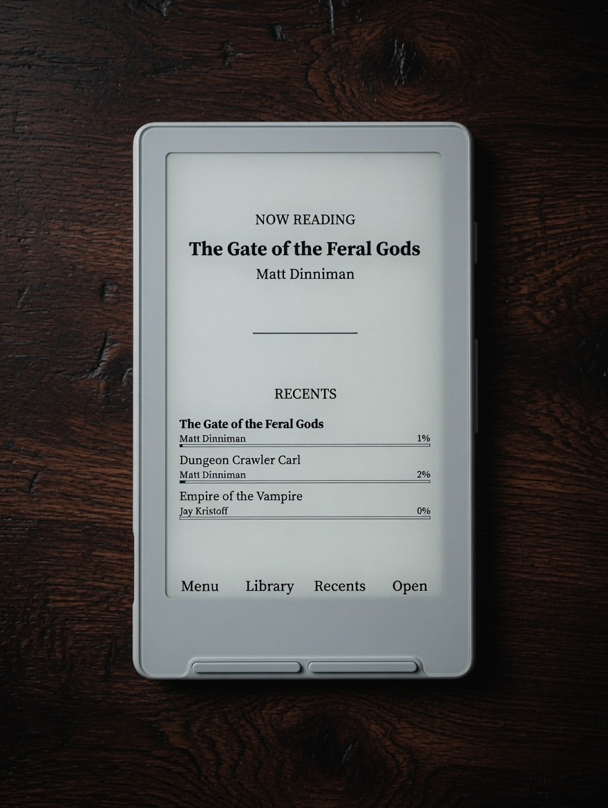
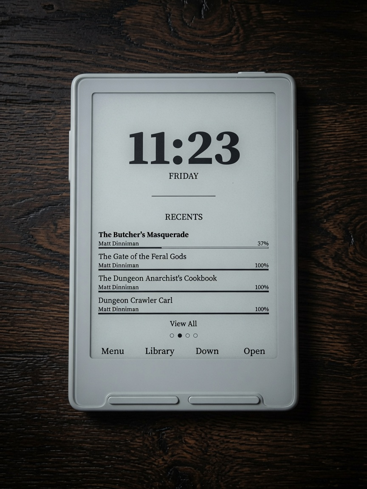
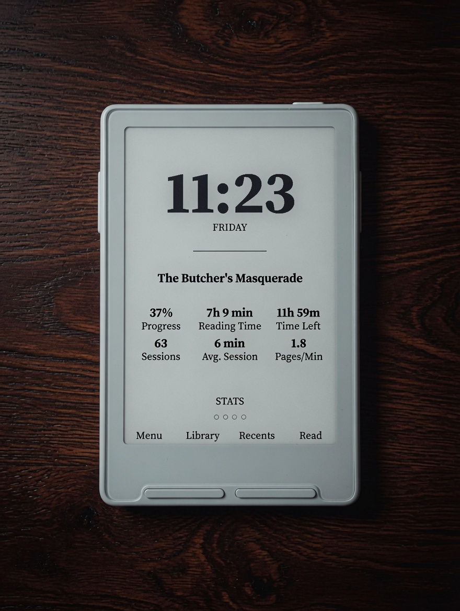
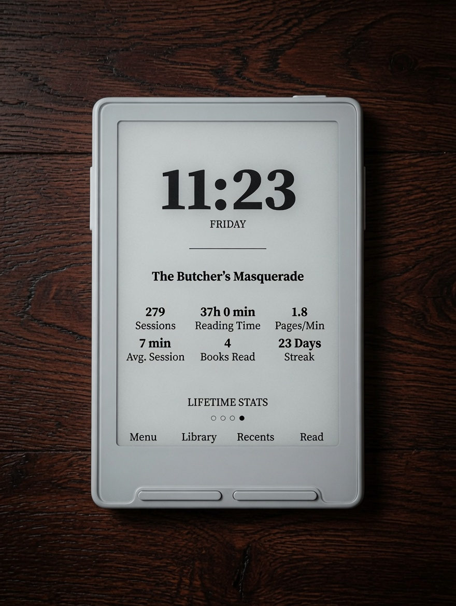

# Casper

Personal firmware for **Xteink X3/X4**, based on
**[CrossPoint Reader 1.5.0](https://github.com/crosspoint-reader/crosspoint-reader/tree/release/1.5.0)** & **[CrossInk](https://github.com/uxjulia/CrossInk)**. Huge thanks to everyone for all their hard work!

Casper keeps CrossPoint's stable reader core and CrossInk's excellent stat tracking, then adds a redesigned UI, a new layout engine (**Rivulet**), thoughtful long-press menus, fully customizable **Reader UI**, **Synopsis Viewer**, and **StarDict Dictionary** with multi-word selection and bilingual packs.

Home themes: **Penumbra** (X3 clock / X4 title) and **Bare**.

<h2 align="center">Themes</h2>

<p align="center">
  Home skins for different reading styles. Pick one under <strong>Settings → Display → Theme</strong>.
</p>

| Penumbra (X3) | Penumbra (X4) | Bare |
|:-------------:|:-------------:|:----:|
|  |  |  |

> **Note:** Clock, weekday, and certain date/time features on Penumbra need the **X3** RTC (the X4 has no real-time clock). Bare looks the same on both devices.

<p align="center">
  <strong>Penumbra Demo</strong><br />
  
</p>

<h2 align="center">Gallery</h2>

| Penumbra Recents | Penumbra Book Stats | Penumbra Lifetime | Synopsis |
|:----------------:|:-------------------:|:-----------------:|:--------:|
|  |  |  |  |

| Reading UI | Multi-Word Lookup | Dictionary Lookup | Reading Stats |
|:----------:|:-----------------:|:-----------------:|:-------------:|
|  |  |  |  |

| Lifetime Stats | Controls | Dictionary Settings | Spanish Translation |
|:--------------:|:--------:|:-------------------:|:-------------------:|
|  |  |  |  |

| Manage Fonts | Customize Reader UI | Settings |
|:------------:|:-------------------:|:--------:|
|  |  |  |

**Full photo tour:** **[docs/casper.md](./docs/casper.md)**

---

## Features

Casper is a personal firmware for the **Xteink X3 and X4** (one binary for both devices). It keeps CrossPoint’s solid reader core and CrossInk’s excellent stats system, then adds a redesigned UI, a new layout engine, and a bunch of quality-of-life improvements.

### Rivulet Layout Engine
Brand-new EPUB layout engine built for e-ink and real books.
- Respects book CSS for font size, line height, and headings (scaled relative to *your* chosen size)
- Text wrapping around floated images
- Drop caps
- Much cleaner simple tables
- Stream-based (doesn’t load entire chapters into RAM)
- Full BiDi / right-to-left support retained

### Themes
Two carefully designed home experiences under **Settings → Display → Theme**:

**Penumbra**  
Text-first hub with side-button panels.  
- **X3**: Large clock + weekday, then cycle Title · Recents · Book Stats · Lifetime  
- **X4**: Last-read title/author on top + scrollable Recents list  

**Bare**  
Minimal cover-focused theme. Same clean layout on both X3 and X4 — just you and the book.

### Reader & Typography
- Completely redesigned **Manage Fonts** with live 50/50 preview
- Built-in fonts: **Source Serif 4** (default) + **Lexend Deca**
- Body sizes: **10 / 12 / 14 / 16 / 18 pt**
- Text Anti-Aliasing with on-device preview
- Fully customizable **Reader UI** (status bar slots, progress bar, etc.)
- Independent status bars for system UI and reader (6 slots each)
- Battery display options (icon, percent, both, or hidden)

### Clippings & Dictionary
- Multi-word selection and clippings (raised limits for small fonts)
- Offline **StarDict** dictionaries with multi-pack cascade
- Multi-word lookup and bilingual packs supported
- Long-press Select → Dictionary (press again for multi-word mode)

### Navigation & Controls
- Fully remappable buttons
- Tabbed navigation (popular setup: side buttons as left/right tabs)
- Long-press menus throughout (Home, Library, Reader)
- Book quick menu (mark finished, synopsis, clear cache, etc.)
- Orient front buttons with reading orientation
- Configurable long-press side buttons (Chapter Skip / Change Orientation)

### Progress, Stats & Library
- CrossInk-style reading stats and progress tracking (can be completely disabled)
- Book Stats and Lifetime Stats panels (Penumbra)
- Progress bars on Recents
- Book Synopsis viewer (from quick menu or library)
- Finished books handling (`/read` folder, hide from Library, Show Read Books in Recents)
- Smarter first-open (skips pure cover/title pages when possible)

### Home & Sleep Experience
- Much snappier return to Home after reading
- Cleaner Home refresh (less residual ghosting)
- PNG wallpaper support (in addition to BMP)
- Sleep screen options (Casper Dark / Casper Light)

### System
- One binary for X3 and X4
- Wi-Fi passwords stored in shared CrossPoint/CrossInk format
- Stats enable/disable + auto-backup
- Menu font size options
- Various stability improvements (low-memory book open, RTC timeouts, etc.)

---

## Docs

| Doc | Contents |
|-----|----------|
| [docs/casper.md](./docs/casper.md) | Visual showcase of Casper changes (photos) |
| [CASPER.md](./CASPER.md) | Scope, APIs, defaults, implementation notes |
| [docs/dictionary.md](./docs/dictionary.md) | StarDict install and lookup behavior |
| [dist/dictionaries/README.txt](./dist/dictionaries/README.txt) | Shipping dictionary packs |

## Build

```bat
pio run -e default
