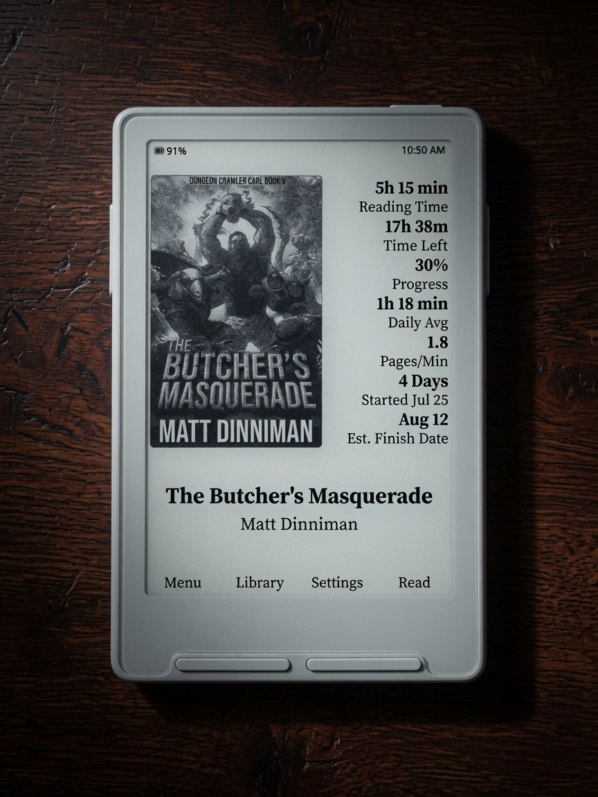
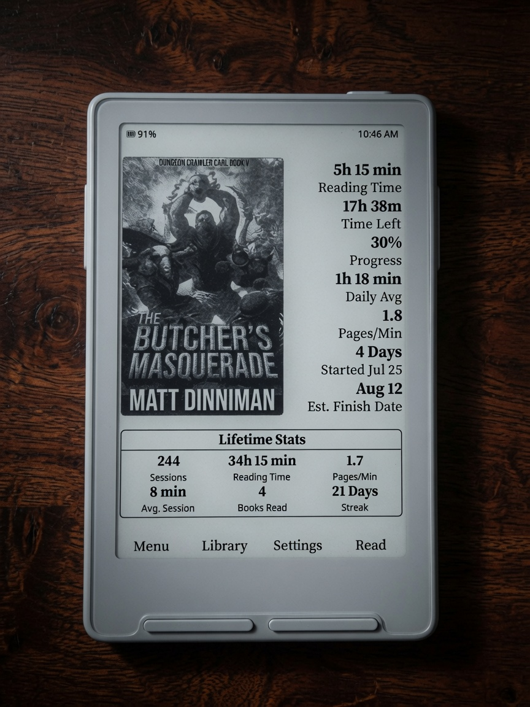
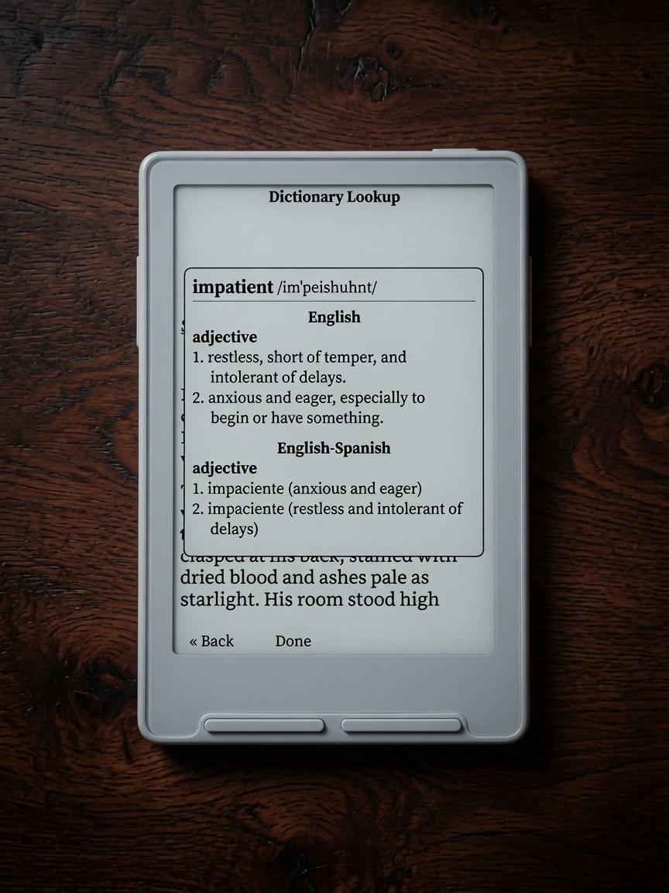
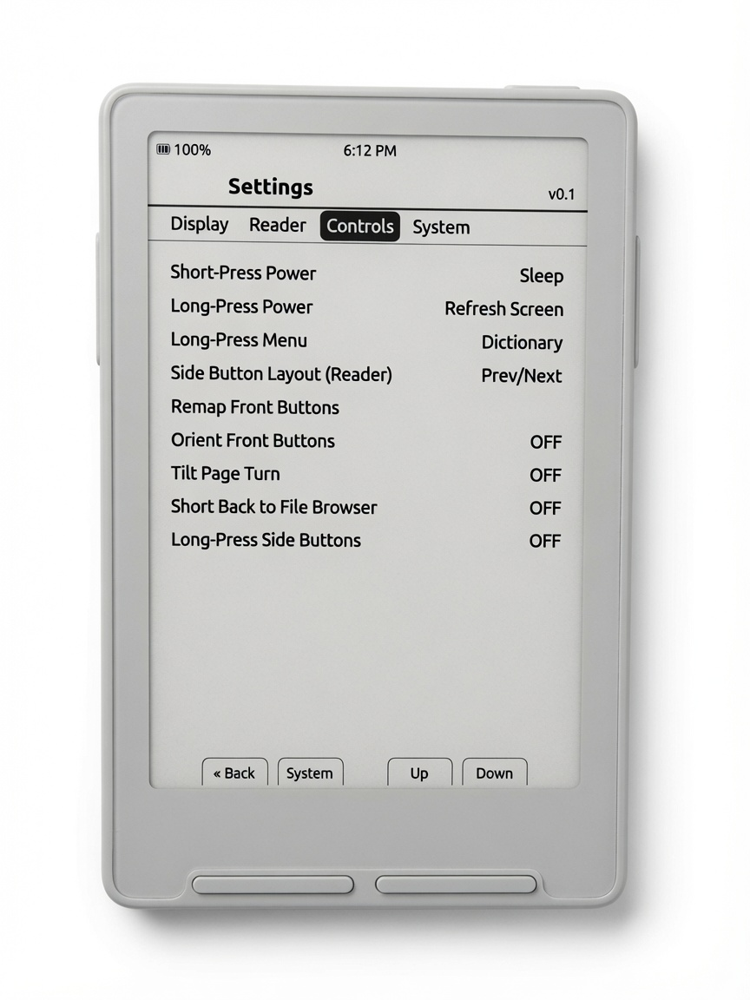
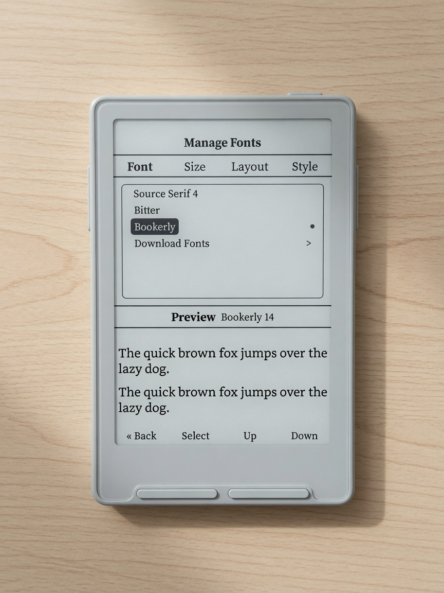
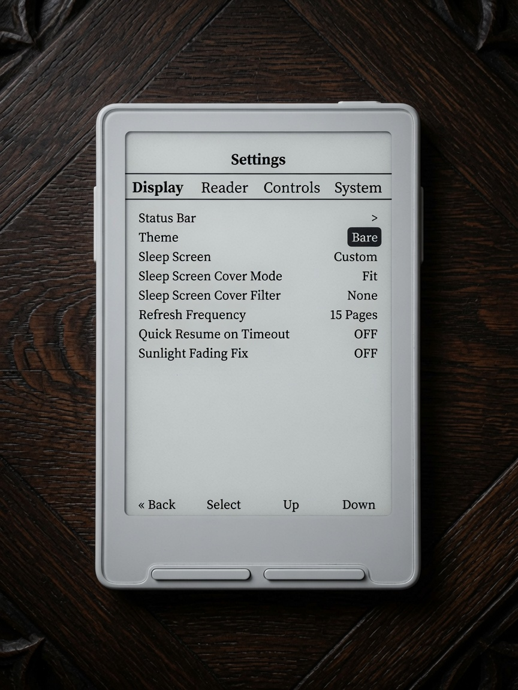

# Casper

Personal firmware for **Xteink X3/X4**, based on
**[CrossPoint Reader 1.5.0](https://github.com/crosspoint-reader/crosspoint-reader/tree/release/1.5.0)**.

Casper keeps CrossPoint’s stable reader core and adds branding plus a
reading-first UI: **Bare**, **Stats**, and **Stats-Life** home themes,
redesigned **reader chrome**, **reading stats**, and a **StarDict dictionary**
with multi-word selection and bilingual packs.

<h2 align="center">Themes</h2>

<p align="center">
  Home skins for different reading styles. Pick one under <strong>Settings → Display → Theme</strong>.
</p>

| Bare | Stats | Stats-Life |
|:----:|:-----:|:----------:|
|  |  |  |
| **Bare** | **Stats** | **Stats-Life** |

| Theme | Who it’s for | Home actions |
|-------|----------------|--------------|
| **Bare** | Just you and the book — large cover, title/author, minimal chrome | **Menu · Library · Synopsis · Read** |
| **Stats** | Book metrics: reading time, time left, progress, pace, start & est. finish | **Menu · Library · Settings · Read** |
| **Stats-Life** | Stats plus **lifetime device stats** on home | Same as Stats |

> **Note:** Certain date/time features only work on the **X3** (the X4 has no real-time clock).

## Screenshots

| Synopsis | Reading UI | Multi-Word Lookup | Dictionary Lookup |
|:--------:|:----------:|:-----------------:|:-----------------:|
|  |  |  |  |
| Synopsis | Reading UI | Multi-Word Lookup | Dictionary Lookup |

| Reading Stats | Lifetime Stats | Controls | Dictionary Settings |
|:-------------:|:--------------:|:--------:|:-------------------:|
|  |  |  |  |
| Reading Stats | Lifetime Stats | Controls | Dictionary Settings |

| Spanish Translation | Manage Fonts | Customize Reader UI | Settings |
|:-------------------:|:------------:|:-------------------:|:--------:|
|  |  |  |  |
| Spanish Translation | Manage Fonts | Customize Reader UI | Settings |

**Full photo tour:** **[docs/casper.md](./docs/casper.md)**

## Highlights

| | |
|---|---|
| **Bare home** | Cover-first, minimal chrome, Synopsis on the front row |
| **Stats / Stats-Life** | Cover + book metrics; Stats-Life adds lifetime totals on home |
| **Reader chrome** | Six-slot status bars, battery modes, progress, time left, chapter, pages |
| **Dictionary** | StarDict packs, multi-pack cascade, multi-word selection, Spanish clitics |
| **Stats tracking** | Per-book + lifetime; optional tracking off; backup under System → Stats |

## Docs

| Doc | Contents |
|-----|----------|
| [docs/casper.md](./docs/casper.md) | Visual showcase of Casper changes (photos) |
| [CASPER.md](./CASPER.md) | Scope, APIs, defaults, implementation notes |
| [docs/dictionary.md](./docs/dictionary.md) | StarDict install and lookup behavior |
| [dist/dictionaries/README.txt](./dist/dictionaries/README.txt) | Shipping dictionary packs |

## Build

```bat
pio run -e default
```

Flash with the CrossPoint web installer (**Custom .bin**) or `esptool` (app at
`0x10000`). Version label: **v0.1.4** (latest tag: **v0.1.3**).

## Credits

- [CrossPoint Reader](https://github.com/crosspoint-reader/crosspoint-reader) — firmware base  
- Casper branding / UI overlay — this project  

## License

See [LICENSE](./LICENSE) (upstream MIT / project terms).
