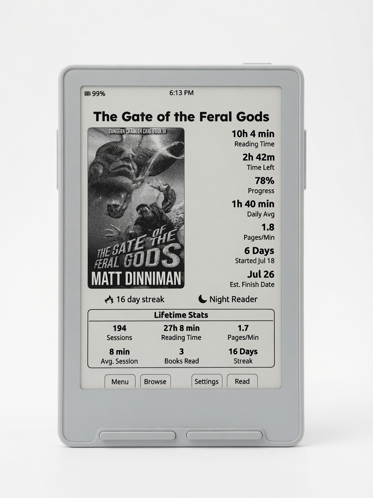
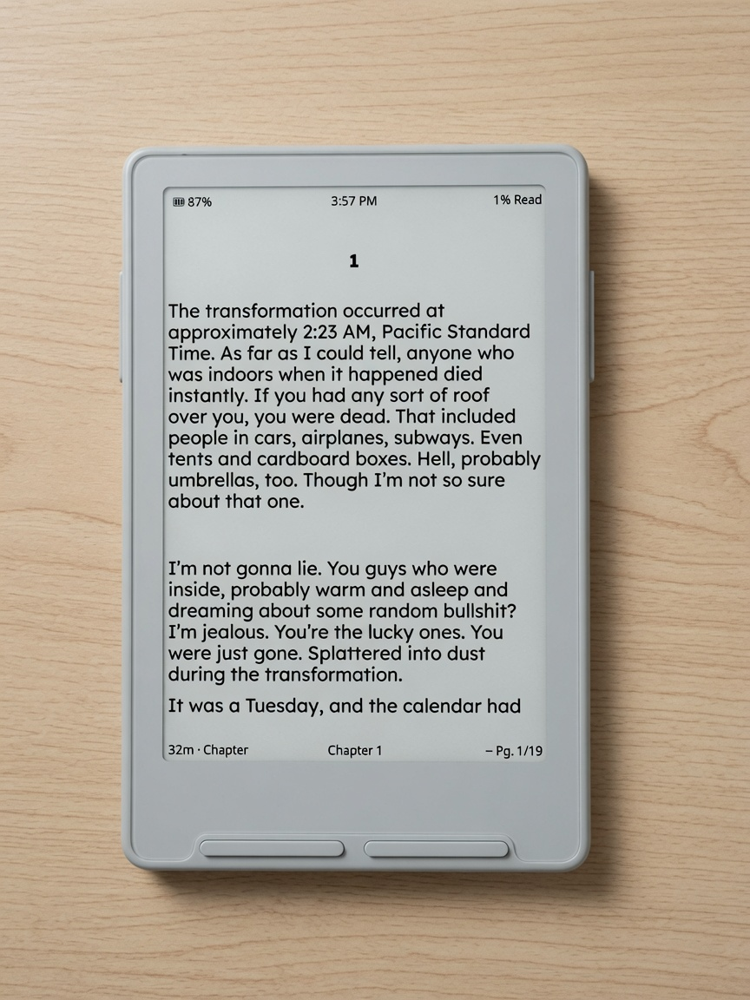
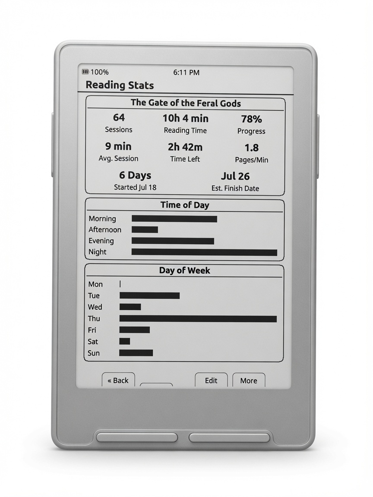
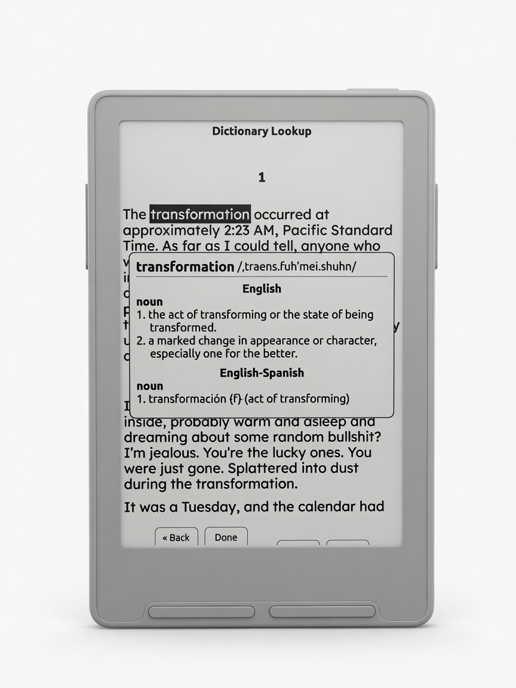

> **This is a personal firmware project built on [CrossPoint Reader](https://github.com/crosspoint-reader/crosspoint-reader) & [CrossInk](https://github.com/uxjulia/crossink)** for the Xteink X3.  
> Product name: **Casper**).

## What's different in Casper

Casper is a personal build of CrossInk (https://github.com/uxjulia/CrossInk), rebranded and tuned for how I actually use the Xteink X3 day to day. On top of CrossInk’s reading stack I added offline dictionary lookup (hyphenated words, multi-word selection, menu long-press to open it), tightened the Dashboard home experience, and improved KOReader Sync with clearer Auto Upload Options. Defaults are set for fewer surprises: short power sleeps the device, side long-press does nothing until you enable it, the status bar shows book progress and time left in Book, the clock stays visible, sleep wallpaper starts light (dark mode inverts the logo cleanly), and the reader opens at 12 pt with left-aligned paragraphs.

<p align="center">
  
</p>

<p align="center"><em>Dashboard Home Screen — Current Book, Reading Stats for Book & Lifetime Device, Streak</em></p>

<table>
  <tr>
    <td align="center" width="33%">
      <br/>
      <em>Reader UI</em>
    </td>
    <td align="center" width="33%">
      <br/>
      <em>Reading Stats Per Book</em>
    </td>
    <td align="center" width="33%">
      <br/>
      <em>Device Lifetime Stats</em>
    </td>
  </tr>
  <tr>
    <td align="center" width="33%">
      <br/>
      <em>Dictionary Lookup</em>
    </td>
    <td align="center" width="33%">
      <br/>
      <em>Multi-Word Lookup</em>
    </td>
    <td align="center" width="33%">
      <br/>
      <em>Spanish Translation</em>
    </td>
  </tr>
  <tr>
      </td>
    <td></td>
  </tr>
</table>

**Full photo tour with captions:** **[docs/casper.md](./docs/casper.md)**

---

**Note**: Target hardware is the **Xteink X3** (ESP32-C3). Flash at your own risk; keep a stock CrossPoint `.bin` so you can revert.

### Casper highlights

- **Casper branding** — boot logo, device names, web portal, serial version strings.
- **Dashboard** home theme (current book cover + reading stats) and related sleep options.
- **Offline dictionary** — in-reader word selection, hyphen compounds, multi-word phrases; long-press Menu defaults to dictionary. It opens word selection on the page; move to a word and press Select to look it up (hyphenated compounds are handled). Press and hold Select to mark a range, move to extend it, then Select again to look up multiple words.
- **KOReader Sync** — credentials + adaptive / furthest-ahead style options.
- **Control defaults**
  - Short power → **Sleep**
  - Long-press Menu → **Dictionary**
  - Side long-press → **Ignore** (no multi-page when resting a finger)
- **Reader status bar** — battery top-right; time remaining shows scope (`in Chapter` / `in Book`).
- Lexend Deca + Bitter reader fonts, Inter UI (from the CrossPoint/CrossInk font work).
- Minimal theme, bookmarks, clippings, bionic reading, guide dots, auto page turn, recent books grid, and the usual CrossPoint reading pipeline.

For version-by-version notes, see [Releases](https://github.com/TweakerInc/casper/releases).

---

### Dictionary

Casper can look up words offline from packs on the SD card (`/.crosspoint/dict/`).

See [Dictionary](./docs/dictionary.md) for pack layout and install notes.

### Reader features & controls

- [Reader Features](./docs/reader-features.md) — options, stats, finished books, reading aids  
- [Controls](./docs/controls.md) — shortcuts and remapping  

---

## Tips for the best reading experience

Casper runs on an ESP32-C3 with limited RAM (~380 KB usable). Large folders or complex EPUBs can be slower than on a phone or tablet.

- Keep folders under about 200 files (50–100 is smoother).
- Split a large library into folders (author, series, read/unread).
- Prefer text-first EPUBs; image-heavy / comic / huge omnibus files are memory-sensitive.
- Rough target: EPUBs under ~20 MB behave best; over ~50 MB may still work but can be slow.
- Use File Transfer’s EPUB optimizer when a book is painful: [Web server](./docs/webserver.md).
- Use a reliable SD card and leave free space for cache, progress, and stats.

---

## Installation

1. Download a `firmware-*.bin` from the [releases page](https://github.com/TweakerInc/casper/releases).
2. Flash with the CrossPoint web installer (**Custom .bin**) or `esptool`.

Step-by-step: **[Installation](./docs/installation.md)**  
To go back to official firmware, reflash from [crosspointreader.com](https://crosspointreader.com/#flash-tools).

---

## Documentation

- [**Casper tour (photos)**](./docs/casper.md)
- [User Guide](./USER_GUIDE.md)
- [Installation](./docs/installation.md)
- [Dictionary](./docs/dictionary.md)
- [Font Build Variants](./docs/font-build-variants.md)
- [Reader Features](./docs/reader-features.md)
- [Controls](./docs/controls.md)
- [Simulator](./docs/simulator.md)
- [Data Cache](./docs/data-cache.md)
- [Web server](./docs/webserver.md)
- [Troubleshooting](./docs/troubleshooting.md)
- [Project scope](./SCOPE.md)
- [Publishing this project](./docs/PUBLISHING.md)

Docs site (after GitHub Pages is enabled): same files under `docs/` via Just the Docs.

---

## Development quick start

PlatformIO:

```sh
pio run -e default
# or tiny / xlarge — see font-build-variants.md
pio run -e default --target upload
```

See [Getting Started](./docs/contributing/getting-started.md) if present, and [AGENTS.md](./AGENTS.md) for embedded constraints.

---

## Internals

Reusable book/device state lives under `.crosspoint` on the SD card.

- [Data Cache](./docs/data-cache.md)
- [File Formats](./docs/file-formats.md)

---

## Credits & license

- Upstream: [CrossPoint Reader](https://github.com/crosspoint-reader/crosspoint-reader) and the broader community.
- Casper is an independent personal build; it is **not** an official CrossPoint or CrossInk release.
- See [LICENSE](./LICENSE) (MIT, same family as upstream unless noted otherwise).
