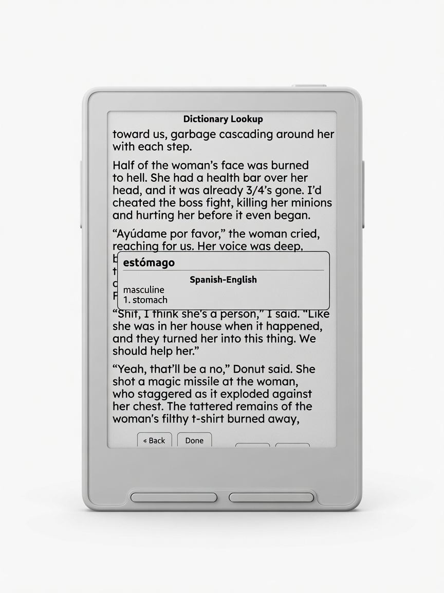

# Casper tour

**Casper** is personal firmware for the **Xteink X3/X4**, built on
[CrossPoint Reader](https://github.com/crosspoint-reader/crosspoint-reader).
It keeps a solid EPUB/TXT reading core, then layers Casper branding and a
quieter reading-first UI: Dashboard home, redesigned reader chrome, reading
stats, and offline dictionary lookup with multi-word selection.

[View on GitHub](https://github.com/TweakerInc/casper) ┬╖
[Releases](https://github.com/TweakerInc/casper/releases) ┬╖
[Installation](./installation.md)

---

## Dashboard home

The home theme is **Dashboard**: current book cover, live reading stats,
lifetime totals, streak, and short front-button labels ΓÇö
**Menu ┬╖ Browse ┬╖ Settings ┬╖ Read**.

*Dashboard home ΓÇö cover art, book metrics, lifetime grid, and streak.*

| Area | Details |
|------|---------|
| Cover | Book cover fills the frame (rounded) |
| Book column | Reading time, time left, progress, daily avg, pages/min, started, est. finish |
| Lifetime | Sessions, reading time, pages/min, avg session, books read, streak |
| Buttons | Menu ┬╖ Browse ┬╖ Settings ┬╖ Read |
| Status bar | Battery + clock |

---

## Reader chrome

Reading view keeps chrome small so the page stays the focus.

*Reader view ΓÇö top battery / clock / completion; bottom time-left, chapter, page.*

| Position | Content |
|----------|---------|
| Top | Battery, clock, book progress (percent complete) |
| Bottom-left | Time left (`3h 51m in Book`) |
| Bottom-center | Chapter title |
| Bottom-right | Chapter pages as `Pg. 1/23` |
| Bottom edge | Thin progress bar (optional) |

Defaults: short power → **Sleep**, long-press menu → **Dictionary**.

---

## Dictionary

Offline **StarDict** (or CXDict-era) packs on the SD card. Multiple packs can
cascade in one card. Open dictionary from the reader (long-press Menu by
default), move to a word, press **Select**.

### Multi-word selection

Long-press **Select** to arm a range, move with Left/Right, short **Select** to
look up the phrase. Collocations such as `por favor` and stemmed forms
(`ayúdame` → help) are supported where the pack has them.

*Multi-word selection — `por favor` → Spanish–English “please”.*

### English + bilingual cascade

Enable several packs. One lookup can show English senses and a bilingual gloss
together, with pronunciation beside the headword.

*English headword with pronunciation, then English and EnglishΓÇôSpanish packs.*

### Spanish on the page

Spanish tokens look up against SpanishΓÇôEnglish packs with accent-aware matching.

*`estómago` → Spanish–English, masculine, “stomach”.*

More detail: [Dictionary](./dictionary.md).

---

## Reading stats

Stats update as you read and appear on Dashboard and in the full **Reading
Stats** screen.

- **Per book** ΓÇö time, progress, pace, sessions, start / est. finish  
- **Lifetime** ΓÇö sessions, total time, pages/min, avg session, books, streak  

---

## Highlights at a glance

- **Casper** branding (boot, portal, serial strings)  
- **Dashboard** home + reader chrome tuned for e-ink  
- **Offline dictionary** with multi-word selection  
- **KOReader Sync** options  
- Control defaults: short power = sleep; side long-press = ignore  
- Status bar: battery; time left scoped `in Book` / `in Chapter`  

---

## Get the firmware

1. Open **[Releases](https://github.com/TweakerInc/casper/releases)**  
2. Download the `.bin` for your build  
3. Follow **[Installation](./installation.md)**  

Upstream project and community support:
[CrossPoint Reader](https://github.com/crosspoint-reader/crosspoint-reader).
