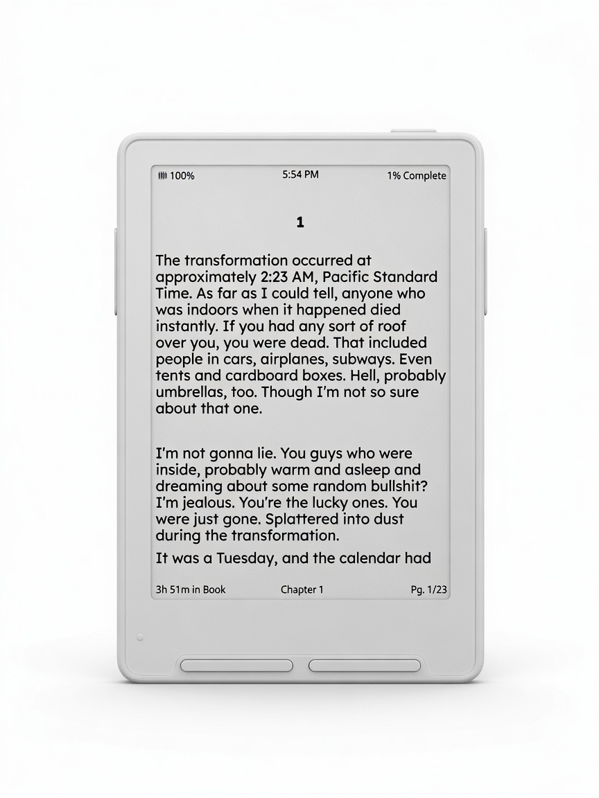
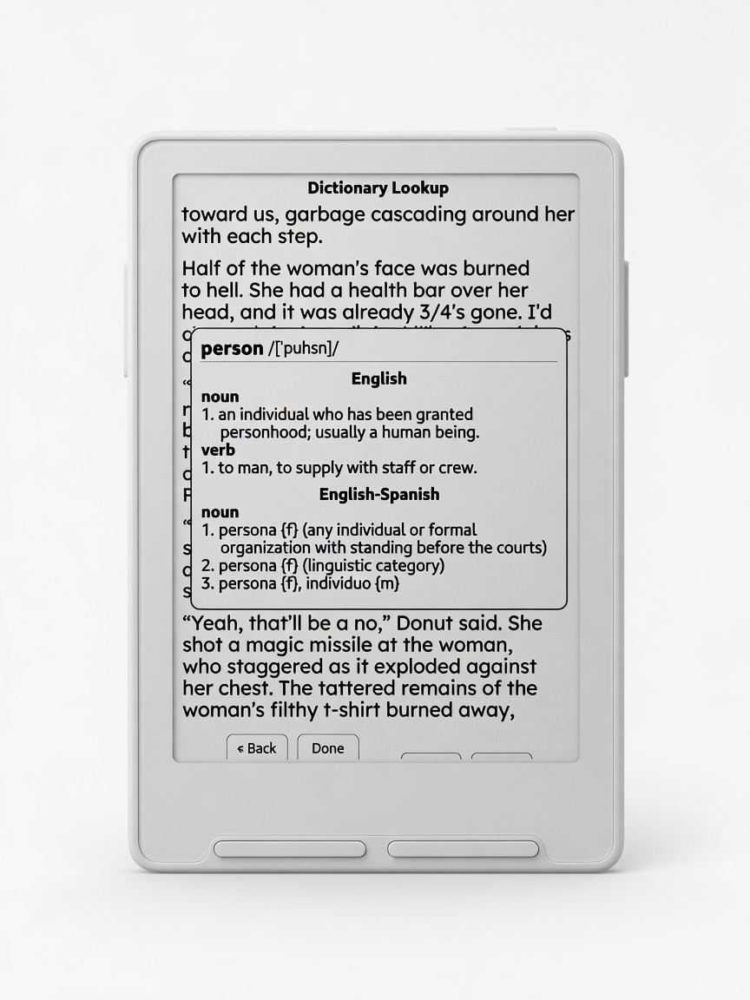

# Casper

Personal e-reader firmware for **Xteink X3/X4**, built on
[CrossPoint Reader](https://github.com/crosspoint-reader/crosspoint-reader).

[View on GitHub](https://github.com/TweakerInc/casper) ·
[Releases](https://github.com/TweakerInc/casper/releases) ·
[Photo tour](./casper.md)

  

## Get firmware

1. Open **[Releases](https://github.com/TweakerInc/casper/releases)**
2. Download `firmware-default.bin` (or `tiny` / `xlarge` if you publish those)
3. Follow **[Installation](./installation.md)**

## What you get

| | |
|---|---|
| **Dashboard** | Cover + book metrics + lifetime stats |
| **Reader chrome** | Battery, clock, % complete, time left, `Pg. n/m` |
| **Dictionary** | Offline lookup, multi-word selection, bilingual packs |
| **Stats** | Per-book and lifetime reading stats |
| **Controls** | Short power = sleep · long-press menu = dictionary |

### Screenshots

  
  &nbsp;
  
  &nbsp;
  

**Full photo tour with captions:** **[Casper tour](./casper.md)**

## User docs

- [Casper tour (photos)](./casper.md)
- [Installation](./installation.md)
- [Dictionary](./dictionary.md)
- [Font Build Variants](./font-build-variants.md)
- [Reader Features](./reader-features.md)
- [Controls](./controls.md)
- [Nearby Position Sync](./nearby-position-sync.md)
- [EPUB Render Modes](./epub-render-modes.md)
- [Simulator](./simulator.md)
- [Data Cache](./data-cache.md)
- [Web Server Guide](./webserver.md)
- [Troubleshooting](./troubleshooting.md)
- [Publishing checklist](./PUBLISHING.md)

## Upstream

Casper is a personal project. Official firmware and community support live at
[CrossPoint](https://github.com/crosspoint-reader/crosspoint-reader) /
[crosspointreader.com](https://crosspointreader.com).
